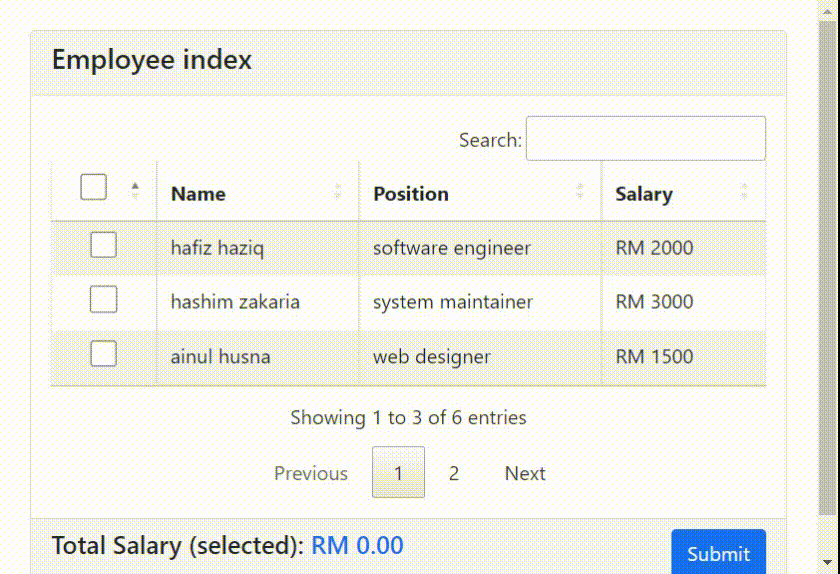

# datatables-checkboxes
Table created using [datatables](https://www.datatables.net/) with checkAll checkbox

---

## Problem Statement
1. Cannot used onchange event on checkbox directly.
2. Checkbox is not working properly when using datatables pagination.

---

## Installation
step by step
* Run `npm install`
* Run `composer install`
* Rename .env.example into .env
* Run `php artisan key:generate`

---

## Stack
It is created using those amazing technologies:
- [Laravel](https://laravel.com/)
- [Bootstrap](https://getbootstrap.com/)
- [JQuery](https://jquery.com/)
- [Alpine](https://alpinejs.dev/)
- And many others!

---

## License
>You can check out the full license [here](https://github.com/hafizhaziq307/datatables-checkboxes/blob/main/LICENSE)

This project is licensed under the terms of the **MIT** license.
